# Backend Setup - What We Did & Why

## 📋 Overview

We've set up your FastAPI backend to connect to Neo4j. Here's what changed and why:

---

## 🔧 Files Created/Modified

### 1. **`backend/app/database/neo4j.py`** (Updated)

**What it does:**
- Manages connection to Neo4j database
- Handles authentication
- Provides session management

**Key Changes:**
```python
# Added dotenv to load .env file
from dotenv import load_dotenv
load_dotenv()

# Added connection testing
def test_connection(self) -> bool:
    """Test if connection works"""
    # Tries to run a simple query
```

**Why:**
- `load_dotenv()` reads your `.env` file automatically
- `test_connection()` lets us verify Neo4j is working
- Better error messages help with debugging

---

### 2. **`backend/main.py`** (Updated)

**What it does:**
- Main entry point for your API
- Starts/stops the server
- Manages Neo4j connection lifecycle

**Key Changes:**
```python
@asynccontextmanager
async def lifespan(app: FastAPI):
    # Startup: Connect to Neo4j when server starts
    neo4j_driver.connect()
    
    yield  # Server runs here
    
    # Shutdown: Close connection when server stops
    neo4j_driver.close()
```

**New Endpoints:**
- `GET /api/health` - Checks if API and Neo4j are working
- `GET /api/test-neo4j` - Detailed Neo4j connection test

**Why:**
- Auto-connects to Neo4j when server starts
- Auto-closes connection when server stops
- Health endpoints help you verify everything works

---

### 3. **`backend/test_connection.py`** (New)

**What it does:**
- Standalone script to test Neo4j connection
- Can run without starting the full server

**Why:**
- Quick way to verify Neo4j setup
- Helps debug connection issues
- Shows helpful error messages

---

### 4. **`backend/setup.ps1`** (New)

**What it does:**
- PowerShell script that automates setup
- Creates virtual environment
- Installs dependencies
- Creates `.env` file

**Why:**
- One command does everything
- Less manual work
- Fewer mistakes

---

### 5. **`NEO4J_SETUP_GUIDE.md`** (New)

**What it does:**
- Step-by-step guide to install Neo4j
- Three installation options
- Troubleshooting tips

**Why:**
- Clear instructions for beginners
- Multiple options (Desktop, Docker, Cloud)
- Helps you choose the right option

---

## 🔄 How It All Works Together

```mermaid
flowchart TB
    Start[You run: uvicorn main:app --reload]
    Start --> Lifespan[Lifespan function starts]
    Lifespan --> LoadEnv[Load .env file]
    LoadEnv --> Connect[Connect to Neo4j]
    Connect --> Test{Connection OK?}
    Test -->|Yes| Running[Server running ✅]
    Test -->|No| Error[Show error ❌]
    Running --> API[API ready at localhost:8000]
    API --> Request[Frontend makes request]
    Request --> Neo4j[Query Neo4j]
    Neo4j --> Response[Return data]
```



---

## 📝 Step-by-Step: What You Need to Do

### Step 1: Install Neo4j
Follow `NEO4J_SETUP_GUIDE.md` - choose one option:
- **Option 1**: Neo4j Desktop (easiest for beginners)
- **Option 2**: Docker (if you use Docker)
- **Option 3**: Neo4j Aura (cloud, no installation)

### Step 2: Set Up Backend
```powershell
cd backend
.\setup.ps1
```

Or manually:
```powershell
python -m venv venv
venv\Scripts\activate
pip install -r requirements.txt
copy env.example .env
```

### Step 3: Configure `.env`
Edit `backend/.env`:
```
NEO4J_URI=bolt://localhost:7687
NEO4J_USER=neo4j
NEO4J_PASSWORD=your_actual_password
```

### Step 4: Test Connection
```powershell
python test_connection.py
```

You should see:
```
✅ Connection successful!
📦 Neo4j Version: 5.x.x
📊 Current nodes in database: 0
🎉 All tests passed!
```

### Step 5: Start Server
```powershell
uvicorn main:app --reload
```

You should see:
```
🚀 Starting Power Grid Visualizer API...
✅ Neo4j connection verified!
INFO:     Uvicorn running on http://127.0.0.1:8000
```

### Step 6: Test API
Open browser:
- http://localhost:8000/api/health
- http://localhost:8000/api/test-neo4j
- http://localhost:8000/docs (Interactive API docs!)

---

## 🎓 Key Concepts Explained

### 1. **Environment Variables (`.env` file)**
- Stores sensitive data (passwords, API keys)
- Not committed to git (in `.gitignore`)
- Loaded automatically by `python-dotenv`

### 2. **Lifespan Events**
- Code that runs when server starts/stops
- Perfect for database connections
- Ensures cleanup when server shuts down

### 3. **Connection Pooling**
- Neo4j driver manages connections efficiently
- Reuses connections instead of creating new ones
- Better performance

### 4. **Session Management**
- Each database query uses a session
- Sessions are automatically closed
- Prevents connection leaks

---

## 🐛 Common Issues & Solutions

### Issue: "Connection refused"
**Solution:** Neo4j isn't running. Start it in Neo4j Desktop.

### Issue: "Authentication failed"
**Solution:** Wrong password in `.env`. Check Neo4j Desktop settings.

### Issue: "Module not found: dotenv"
**Solution:** Run `pip install -r requirements.txt` again.

### Issue: "Port 7687 already in use"
**Solution:** Another Neo4j instance is running. Stop it first.

---

## ✅ What's Next?

Once Neo4j is connected:
1. ✅ Create database schema (define node types and relationships)
2. ✅ Import your GeoJSON data
3. ✅ Implement graph traversal queries
4. ✅ Connect frontend to backend

---

## 📚 Learn More

- **FastAPI Docs**: https://fastapi.tiangolo.com/
- **Neo4j Python Driver**: https://neo4j.com/docs/python-manual/current/
- **Neo4j Cypher Query Language**: https://neo4j.com/docs/cypher-manual/current/
